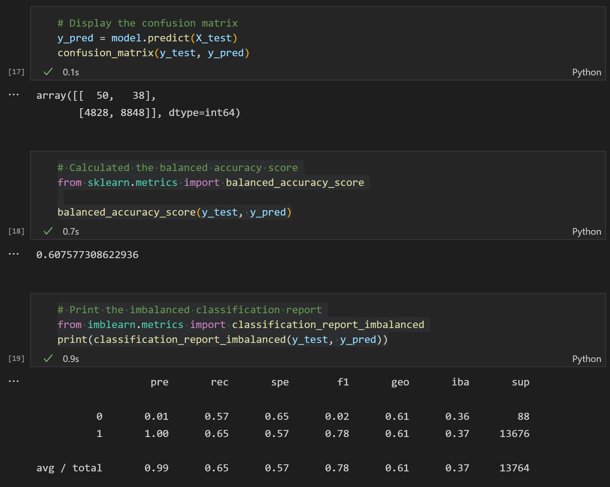
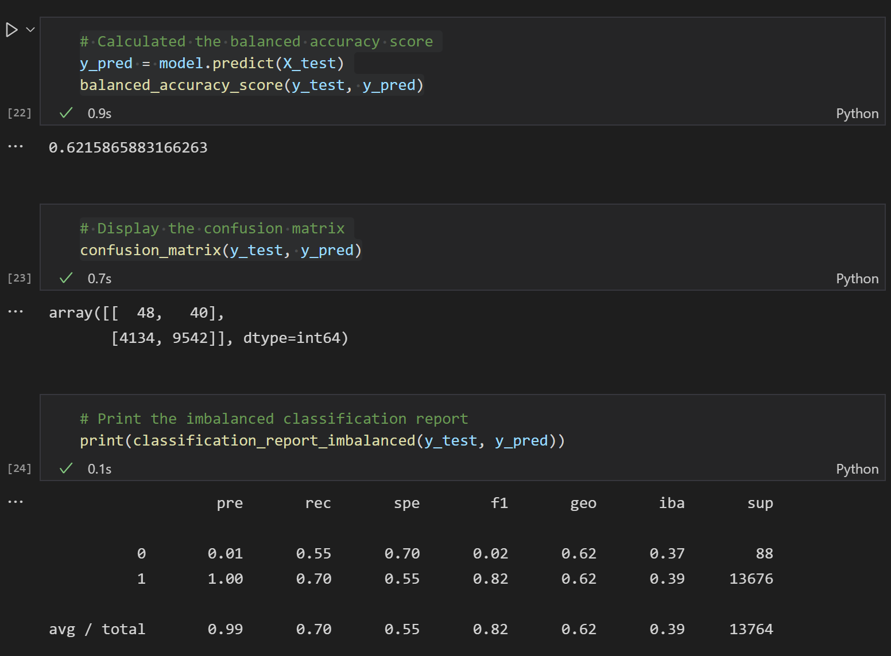
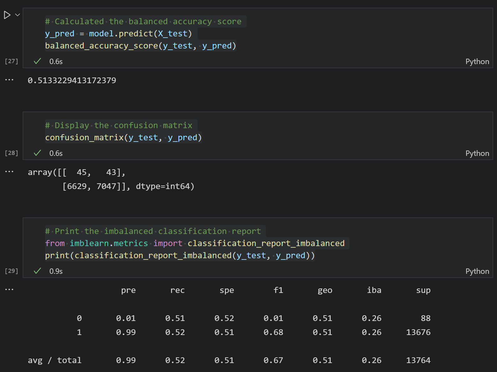
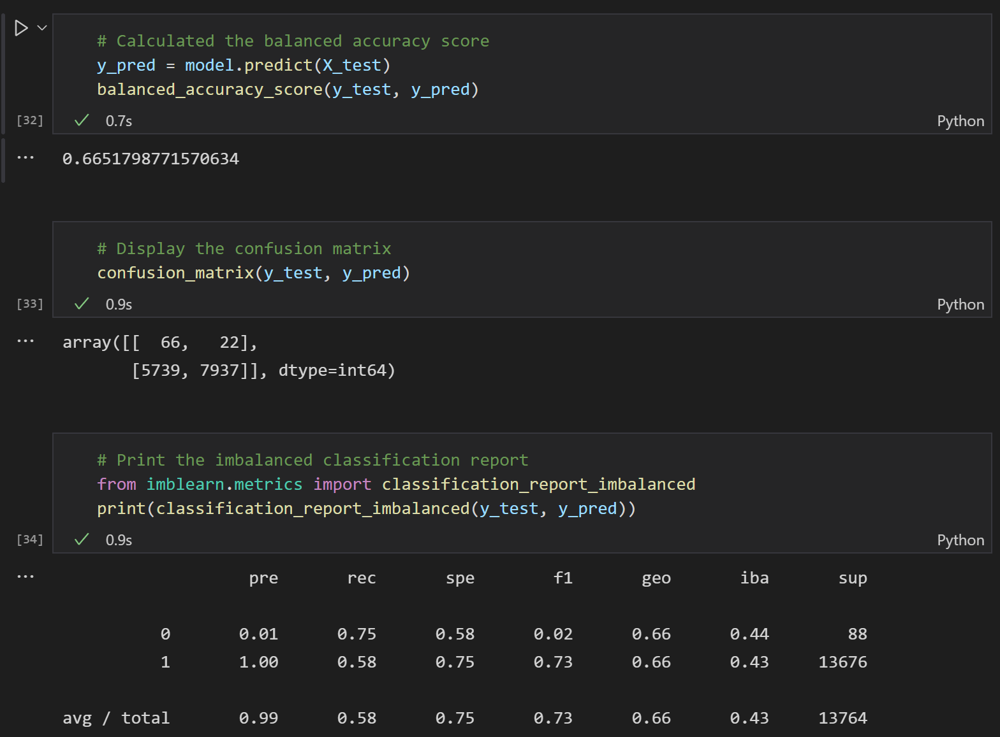
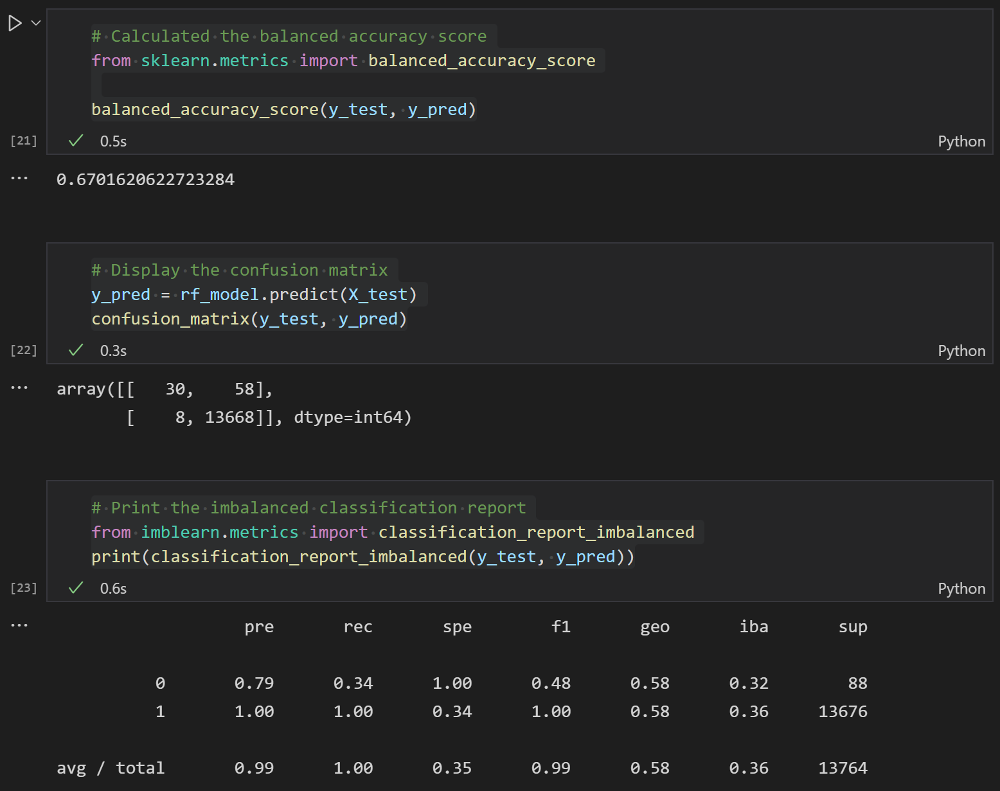
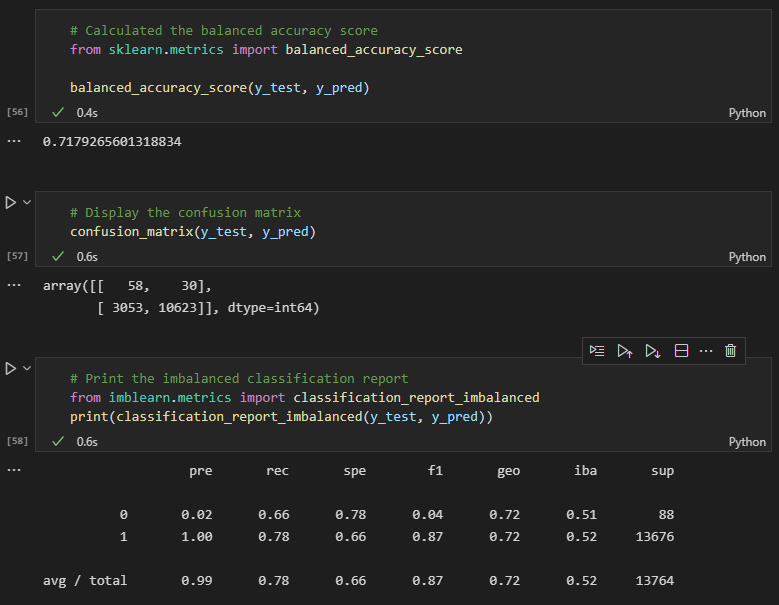

# RBCModule17-Challenge

## Overview of Analysis

This challenge seeks to demonstrate usage of several different classification algorithms from the ```imbalanced-learn``` and ```scikit-learn``` packages. The classifiers used are:

- ```RandomOverSampler```
- ```SMOTE```
- ```ClusterCentroids```
- ```SMOTEEN```
- ```BalancedRandomForestClassifier```
- ```EasyEnsembleClassifier```

The context of this challenge is analyzing the results of different classifiers for the purposes of predicting Credit Risk. 

## Results

Looking at the results below, the BalancedRandomForest Classifier appears to perform the best. It has the highest balanced accuracy score and precision and appears to minimize errors best.

### RandomOverSampler



### SMOTE



### ClusterCentroids



### SMOTEEN



### BalancedRandomForestClassifier



### EasyEnsembleClassifier



## Summary

For the intent of determining the risk of loans, it isn't clear that any of the considered models are worth using. While it is ok for our model to produce false positives, all the classifiers except the BalancedRandomForest classifier seem to produce tremendous amounts of false positives. The amount of false negatives produced by the BalancedRandomForest classifier is not good for the candidacy of this classifier since in our context that would mean mis-flagging high risk loans as low risk. Overall we cannot recommend and of the tested models.
